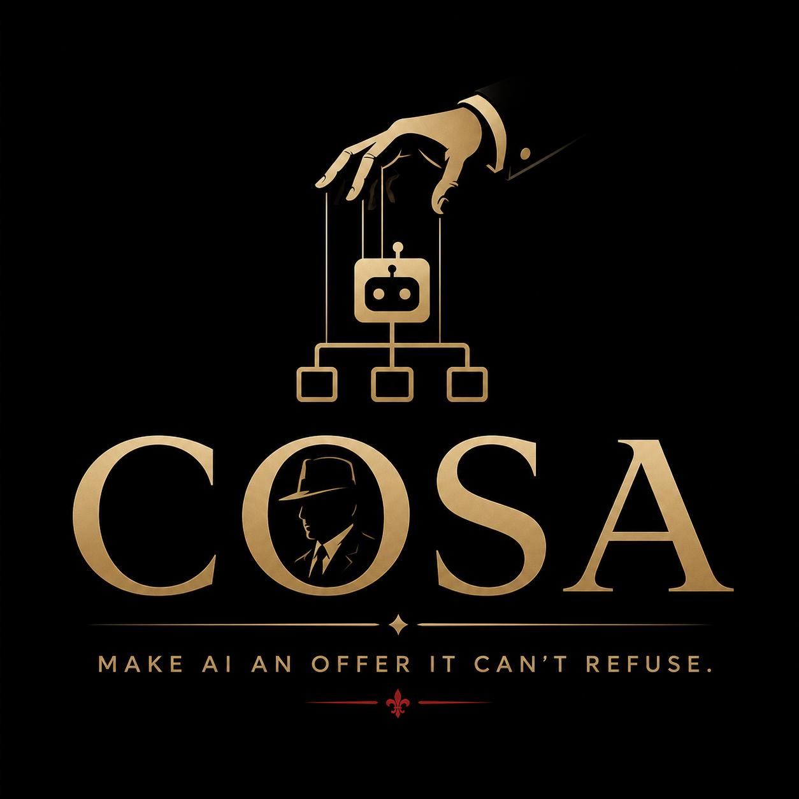

# Cosa

> Cosa - Make AI an offer it can't refuse.

A skill and agent system for Claude Code built on the *Commissione* principle:
a **Consigliere** plans and orchestrates, specialized **Famiglie** execute,
and every Famiglia has its own **Revisore** who signs off on the work before
it goes back to the Consigliere.

## Principle

```
                       ┌──────────────────┐
   Request  ─────────► │   CONSIGLIERE    │  plans, delegates, accepts
                       │   (main skill)   │  NEVER writes code
                       └────────┬─────────┘
                                │ CONTRATTO + worktree
                ┌───────────────┼───────────────┐
                ▼               ▼               ▼
        ┌──────────────┐ ┌─────────────┐ ┌─────────────┐
        │ Capo Codice  │ │Capo Disegno │ │ Capo Mercato│   research → design
        └──────┬───────┘ └──────┬──────┘ └──────┬──────┘   ↑ Consigliere gate
               │                │               │           plan → implement
               │                │               │           ↑ Consigliere gate
               ▼                ▼               ▼
        ┌──────────────┐ ┌─────────────┐ ┌─────────────┐
        │Revisore Cod. │ │Revisore Dis.│ │Revisore Mer.│   checks, approves
        └──────┬───────┘ └──────┬──────┘ └──────┬──────┘   the Implement phase
               └────────────────┼───────────────┘
                                │ RAPPORTO (only when `approvato`)
                                ▼
                       ┌──────────────────┐
                       │   CONSIGLIERE    │  accepts, merges worktree, deletes it
                       └──────────────────┘
```

Core rule: **A Rapporto only reaches the Consigliere once its Revisore has
issued `approvato`.** The Consigliere doesn't trust the Rapporto — it checks
the evidence against its own Contratto's acceptance criteria.

Every work package runs through a **phase chain**: research → design → plan
→ implement, each a fresh dispatch inside a dedicated git worktree. The
Consigliere gates Design and Plan itself (structural check against the
Contratto); the Revisore only ever reviews the Implement phase's Rapporto.
Capi commit freely inside their worktree; only the Consigliere merges it
into the base branch and deletes it, once `approvato`. Ambiguity inside a
phase becomes a documented **assumption**, not a question back — only a
genuinely missing prerequisite (e.g. no approved Disegno concept) stops the
chain with `Outcome: failed`. Disegno collapses the chain into two phases
(Concept = research+design, Build = plan+implement); the other Famiglie run
all four separately.

## End-to-end process for one requirement

The overview above shows the actors. Here's the full lifecycle of a single
work package, start to finish:

```
Request
   │
   ▼
┌─────────────────────────────────────────────────────────────────┐
│ CONSIGLIERE — Understand                                        │
│ observable outcome? domains? out of scope? worthless-if-wrong?  │
└───────────────────────────┬─────────────────────────────────────┘
                            │ unfamiliar codebase?
                            ▼
                   ┌──────────────────┐
                   │  OCCHIO (recon)  │  read-only, facts only, optional
                   └────────┬─────────┘
                            ▼
┌───────────────────────────────────────────────────────────────┐
│ CONSIGLIERE — Il Piano                                        │
│ .commission/<slug>/plan.md : goal, steps, assumptions, risks  │
│ → aligned with requester before any Capo is touched           │
└───────────────────────────┬───────────────────────────────────┘
                            ▼
┌───────────────────────────────────────────────────────────┐
│ CONSIGLIERE — per step: write CONTRATTO, create worktree  │
│ .commission/<slug>/<n>-<famiglia>/contract.md             │
└───────────────────────────┬───────────────────────────────┘
                            ▼
        ╔════════════════════════════════════════════════╗
        ║          PHASE CHAIN (fresh Capo dispatch      ║
        ║          per phase, same worktree throughout)  ║
        ╚════════════════════════════════════════════════╝
                            │
                            ▼
                  ┌─────────────────┐
                  │  RESEARCH       │  research.md
                  │  (Capo, fresh)  │  no code changes
                  └─────────┬───────┘
                            ▼
                  ┌─────────────────┐
                  │  DESIGN         │  design.md
                  │  (Capo, fresh)  │  approach + Assumptions
                  └─────────┬───────┘
                            ▼
                  ◇──────────────────◇
                  │ CONSIGLIERE GATE │  structural: matches Contratto?
                  ◇──────────────────◇
                   │ drift        │ ok
                   ▼              ▼
            back to DESIGN   ┌─────────────────┐
                             │  PLAN           │  plan.md
                             │  (Capo, fresh)  │  ordered checklist
                             └─────────┬───────┘
                                       ▼
                             ◇──────────────────◇
                             │ CONSIGLIERE GATE │  structural: matches Contratto?
                             ◇──────────────────◇
                              │ drift        │ ok
                              ▼              ▼
                       back to PLAN    ┌─────────────────┐
                                       │  IMPLEMENT      │  report.md
                                       │  (Capo, fresh)  │  red→green→refactor,
                                       │                 │  commits in worktree
                                       └─────────┬───────┘
                                                 ▼
                                       ┌─────────────────┐
                                       │  REVISORE       │  runs it itself,
                                       │                 │  doesn't trust text
                                       └─────────┬───────┘
                                                 │
                                  ┌──────────────┴──────────────┐
                                  │ respinto                    │ approvato
                                 ▼                              ▼
                          back to IMPLEMENT      ┌──────────────────────┐
                          (round+1, max 3        │ RAPPORTO + VERDETTO  │
                          before escalation)     │ → Consigliere        │
                                                 └────────────┬─────────┘
                                                              ▼
                                       ┌─────────────────────────────────────────┐
                                       │ CONSIGLIERE — Acceptance                │
                                       │ every AC: evidenced? spot-checked?      │
                                       │ assumptions reasonable? deviations ok?  │
                                       └────────┬──────────────────┬─────────────┘
                                                │ AC not covered   │ all covered
                                                ▼                  ▼
                                        rework CONTRATTO    ┌────────────────────────┐
                                        (back to IMPLEMENT) │ merge worktree → base  │
                                                            │ delete worktree        │
                                                            │ carry Handoff forward  │
                                                            └───────────┬────────────┘
                                                                        ▼
                                                             next step's Contratto,
                                                             or Wrap-up to requester
```

Every arrow that isn't a phase-to-phase step is a place the loop can repeat:
Revisore rejection re-runs Implement only; a Consigliere gate finding
drift re-runs the phase it gated, not the whole chain; acceptance failure
re-runs Implement against a corrected Contratto, never a hand-fix by the
Consigliere itself.

## Directory structure

```
.claude-plugin/
│   └── plugin.json            Plugin manifest (name, version, ...)
agents/                        Subagent definitions (executors)
│   ├── capo-codice.md         Implementation, strictly test-driven
│   ├── revisore-codice.md     Code acceptance
│   ├── ricercatore-codice.md  Library research (license, CVEs, currency)
│   ├── capo-disegno.md        Visual concepts & UI implementation
│   ├── revisore-disegno.md    Design acceptance
│   ├── capo-mercato.md        Marketing, positioning, content
│   ├── revisore-mercato.md    Marketing acceptance
│   └── occhio.md              Recon, read-only research
└── skills/                    Doctrine (the HOW)
    ├── consigliere/           Main skill — orchestration
    │   └── references/
    │       ├── contract.md    Work order format
    │       ├── report.md      Report & verdict format
    │       ├── families.md    Registry of all Famiglie
    │       └── models.md      Model policy
    ├── famiglia-codice/       Software development doctrine (TDD)
    ├── famiglia-disegno/      Visual doctrine (concept before code)
    ├── famiglia-mercato/      Marketing doctrine
    └── nuova-famiglia/        Guide: founding a new Famiglia
```

Installed as a plugin, skills are namespaced (`/cosa:consigliere`) to avoid
clashing with other plugins. Locally, during development, `claude
--plugin-dir .` loads it without installing anything.

Generated working documents also use English names: `.commission/<slug>/plan.md`
for the overall Plan, `docs/design/<slug>.md` for Disegno (design) concepts, and 
per work package `.commission/<slug>/<n>-<famiglia>/{contract,research,design,
plan,report}.md` for the phase chain's artifacts.

## Installation

This repo doubles as its own single-plugin marketplace
(`.claude-plugin/marketplace.json`):

```
claude plugin marketplace add rokde/cosa-claude
claude plugin install cosa@cosa-claude
```

For local development, point Claude Code straight at the checkout instead —
no install step, no marketplace:

```
claude --plugin-dir /path/to/cosa-claude
```

## Usage

```
/cosa:consigliere Build me a rate limiter for the API
```

Or just state a task — the Consigliere skill picks up multi-step work
automatically.

## Two non-negotiable doctrines

1. **Software is built test-driven.** Red test first, evidence in the
   Rapporto. No test = no `approvato`. See `famiglia-codice`.
2. **Visuals are drawn before they're built.** A mockup/design draft must be
   approved by the **Don**, not the Consigliere — the Consigliere renders it
   in-browser (`Artifact` tool) as the decision basis and waits for an
   explicit yes before implementation starts. See `famiglia-disegno`.

## Model policy (short version)

| Role           | Model  | Why |
|----------------|--------|-----|
| Consigliere    | opus   | Planning, decomposition, acceptance — pure reasoning |
| Revisori       | opus   | Quality gate, must find gaps, not just read |
| Capi           | sonnet | Execution against a precise Contratto |
| Occhio         | haiku  | Broad search, gathering, summarizing |

Famiglia Codice adds one optional internal role: `ricercatore-codice`
(sonnet), dispatched by Capo Codice during Research to vet third-party
libraries — license, maintenance/currency, known CVEs — whenever the Don has
allowed reusing existing code instead of building everything from scratch.

Details and escalation rules: `skills/consigliere/references/models.md`

## Extending

Need a new specialization? `skills/nuova-famiglia/SKILL.md` describes
the blueprint: Capo + Revisore + doctrine skill + registry entry.
